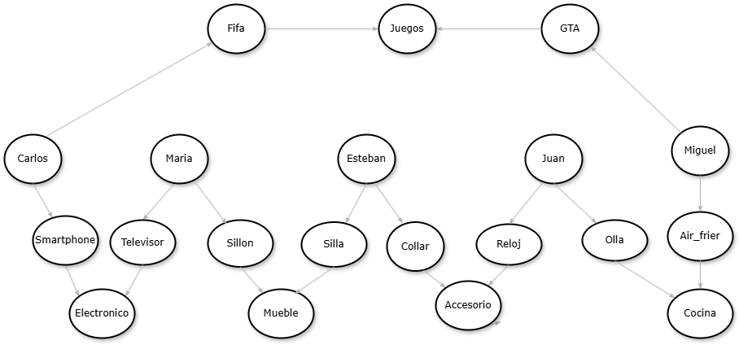

# ProyectoIA
# Proyecto: Sistema de Recomendación de Productos en Prolog

## Descripción
Este proyecto implementa un **sistema de recomendación de productos** utilizando **Prolog**. Se modela un grafo donde los **usuarios** están conectados con los **productos** que han comprado, y estos productos están categorizados. También se incluyen calificaciones de los productos, lo que permite realizar consultas y generar recomendaciones basadas en relaciones dentro del grafo.

## Estructura del Proyecto
El proyecto está compuesto por los siguientes elementos:

- **Diseño de Variables**: Contiene la información de usuarios, productos, compras y calificaciones.
- **Reglas de conexión (Grafo)**: Define las relaciones entre usuarios, productos y categorías.
- **Consultas de recomendación**: Permite obtener productos recomendados para un usuario basándose en distintos criterios.

## Uso y Ejecucuion del Programa

### Ejecución
1. **Abrir SWI-Prolog**. Puede abrirse en el navegador por medio de este [link](https://swish.swi-prolog.org/).
2. **Diseño de las variables**:
   ```prolog
   % Definición de usuarios
   usuario(maria).
   usuario(carlos).
   usuario(juan).
   usuario(esteban).
   usuario(miguel).

   % Definición de productos y categorías
   producto(televisor, electronico).
   producto(smartphone, electronico).
   producto(sillon, mueble).
   producto(silla, mueble).
   producto(reloj, accesorio).
   producto(collar, accesorio).
   producto(air_frier, cocina).
   producto(olla, cocina).
   producto(gta, juegos).
   producto(fifa, juegos).

   % Definición de compras de usuario
   compra(maria, televisor).
   compra(maria, sillon).
   compra(carlos, fifa).
   compra(carlos, smartphone).
   compra(juan, reloj).
   compra(juan, olla).
   compra(esteban, silla).
   compra(esteban, collar).
   compra(miguel, gta).
   compra(miguel, air_frier).

   % Definición de calificaciones de productos (1-5)
   calificacion(maria, televisor, 3).
   calificacion(maria, sillon, 4).
   calificacion(carlos, smartphone, 4).
   calificacion(carlos, fifa, 5).
   calificacion(juan, reloj, 5).
   calificacion(juan, collar, 2).
   calificacion(esteban, silla, 1).
   calificacion(esteban, collar, 1).
   calificacion(miguel, air_frier, 3).
   calificacion(miguel, gta, 5).

<br><br>

### 3. Analizar Grafo Generado por medio del diseño de las variables



- Las flechas indican qué compró cada usuario y a qué categoría pertenece cada producto.  
  Esto permite hacer recomendaciones, como sugerir productos de la misma categoría a diferentes usuarios.
- **Ejemplo de Conexiones:**  
  - **Carlos** compró un **Smartphone** de la categoría **Electrónicos**.  
  - **María** también compró algo de **Electrónicos**, pero su compra fue un **Televisor**.


4. **Ejecutar consultas** para interactuar con el sistema:
   
 - **Consulta de productos comprados:**

     Forma general de la relación:
     ```prolog
     Compra(Usuario, Producto).
     ```
     Ejemplo de consulta en Prolog:
     ```prolog
      compra(juan,Producto).
     ```
     
 - **Calificación que un usuario :**
  
     Forma general de la relación:
     ```prolog
        Calificacion (Usuario, Producto, Puntuacion).
        ```
        Ejemplo de consulta en Prolog:
     ```prolog
      clasificacion(maria, televisor, Puntuacion)
     ```
  - **Regla de Recomendación:**
  
     Forma general de la relación:
     ```prolog
     compra(Usuario, ProductoComprado), 
     producto(ProductoComprado, Categoria), 
     producto(ProductoRecomendado, Categoria), 
     ProductoComprado \= ProductoRecomendado.
     ```
 - **Recomendación por buena calificación:**

      Forma general de la relación:
     ```prolog
     calificacion(OtroUsuario, ProductoRecomendado, Puntuacion),
     Puntuacion >= 4, Usuario \= OtroUsuario.
     ```
     Ejemplo de consulta en Prolog:
      ```prolog
     calificacion(OtroUsuario, ProductoRecomendado, Puntuacion),
     Puntuacion >= 4, juan \= OtroUsuario.
     ```
 - **Recomendación buena calificación (Lista):**

      Forma general de la relación:
     ```prolog
     findall((Producto, Puntuacion), 
     (recomendar_por_calificacion(juan, Producto), 
     calificacion(_, Producto, Puntuacion)), 
     Lista).
     ```
- **Recomendación recursiva:**
     
     Definición de regla en Prolog:
     ```prolog
     recomendar_recursivo(_, [], []).
   
     recomendar_recursivo(Usuario, [ProductoComprado|Resto], ListaFinal) :-
         findall(ProductoRecomendado,
             (producto(ProductoRecomendado, Categoria),
              producto(ProductoComprado, Categoria),
              ProductoComprado \= ProductoRecomendado,
              not(compra(Usuario, ProductoRecomendado))),
             Recomendaciones),
         recomendar_recursivo(Usuario, Resto, RestoRecomendados),
         append(Recomendaciones, RestoRecomendados, ListaSinDuplicados),
         sort(ListaSinDuplicados, ListaFinal).
   
     recomendar_con_recursion(Usuario, ListaRecomendada) :-
         findall(Producto, compra(Usuario, Producto), Compras),
         recomendar_recursivo(Usuario, Compras, ListaRecomendada).
   ```
   
   Forma general de la relación:
      ```prolog
     recomendar_con_recursion(Usuario, Lista).
     ```
   
     Ejemplo de consulta en Prolog:
     ```prolog
     recomendar_con_recursion(maria, Lista).
      ```

- **Top 10 mejores productos:**
     Forma general de la relación:
     ```prolog
     findall((Usuario, Producto, Puntuacion),(calificacion(Usuario,Producto, Puntuacion), Puntuacion > 3), 
     Lista). 
     ```
   Ejemplo de consulta en Prolog:
     ```prolog
     findall((juan, Producto, Puntuacion), 
       (calificacion(juan, Producto, Puntuacion), 
        Puntuacion > 3), 
       Lista).
      ```


 **Presentado Por:**
- Natalia Echeverry Salcedo
- Esteban Altamiranda Julio
- Miguel Bayona Rivera
- Juan Morales Espitia
